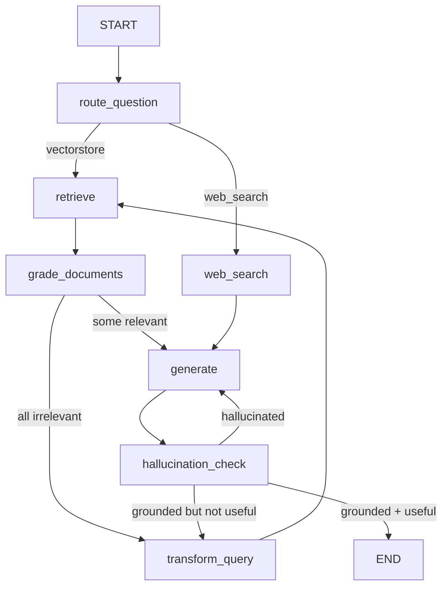

# Certilab Adaptive RAG

Implementación canónica del patrón **Adaptive RAG** con LangGraph, OpenAI y Tavily, aplicada a consultas sobre certificados de calibración. El grafo de 7 nodos con dos loops de auto-corrección (reescritura de query y verificación de alucinaciones) sigue la topología del artículo de referencia.

**Referencia**: [Building an Adaptive RAG System with LangGraph, OpenAI and Tavily](https://levelup.gitconnected.com/building-an-adaptive-rag-system-with-langgraph-openai-and-tavily-c4ee39d2f021)

## Arquitectura del grafo



### Nodos

- **route_question** — Clasifica la pregunta con LLM (Pydantic structured output). Decide entre búsqueda vectorial o web search.
- **retrieve** — Recupera documentos del vector store (Qdrant o índice en memoria).
- **grade_documents** — Evalúa cada documento recuperado: ¿es relevante para la pregunta? Los irrelevantes se descartan.
- **transform_query** — Reescribe la pregunta para mejorar la recuperación cuando ningún documento es relevante.
- **web_search** — Busca en la web con Tavily cuando la pregunta requiere conocimiento externo.
- **generate** — Genera la respuesta final con LLM usando el contexto recuperado.
- **hallucination_check** — Verifica que la respuesta esté respaldada por los documentos y que resuelva la pregunta.

### Loops de auto-corrección

1. **Rewrite loop**: si ningún documento es relevante → reescribe la query → re-intenta (máx. 3 intentos).
2. **Regenerate loop**: si la respuesta alucina → regenera (máx. 2 intentos). Si no es útil → reescribe.

## Instalación

```bash
git clone <repo-url>
cd certilab-adaptive-rag
uv sync
cp .env.example .env
# Editar .env con tu OPENAI_API_KEY
```

## Uso

### Demo CLI

```bash
uv run python -m app.adaptive_rag.demo "¿Cuántos certificados vigentes tiene el cliente 101?"
```

### Notebook

```bash
uv run jupyter notebook notebooks/adaptive_rag_demo.ipynb
```

### Modo real (ingesta desde S3)

```bash
docker compose up -d qdrant
APP_MODE=real uv run python -m app.adaptive_rag.ingest
```

## Tecnologías

- Python 3.11+
- LangGraph (StateGraph)
- OpenAI (GPT-4o-mini, text-embedding-3-small)
- Tavily Search API
- Pydantic v2 (structured output)
- Qdrant (vector store, modo real)
- MySQL + S3 (datos de dominio, modo real)
- Phoenix/OpenInference (observability, opcional)

## Estructura

```
app/
├── adaptive_rag/     # Grafo canónico de 7 nodos
├── domain/           # Modelos de dominio
├── ingestion/        # Carga de datos (mock/MySQL/S3)
├── retrieval/        # Vector store (InMemory/Qdrant)
├── tools/            # Embeddings, OpenAI, Tavily, MySQL
├── observability/    # Phoenix tracing
└── security/         # Roles y control de acceso
```

## Pruebas

```bash
uv run pytest -q
```

## Referencias

- [Building an Adaptive RAG System — LevelUp](https://levelup.gitconnected.com/building-an-adaptive-rag-system-with-langgraph-openai-and-tavily-c4ee39d2f021)
- [LangGraph Documentation](https://langchain-ai.github.io/langgraph/)
