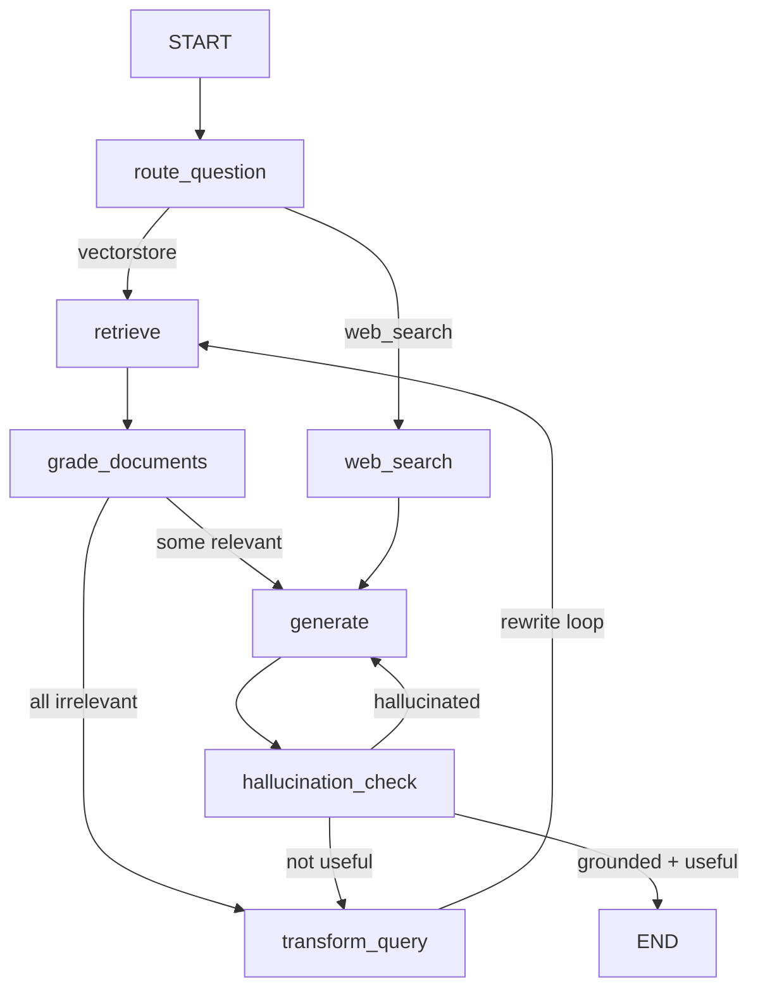

# Certilab Adaptive RAG


[](https://codecov.io/gh/emersonheto/certilab-adaptive-rag)


Implementación del patrón **Adaptive RAG** con LangGraph, OpenAI y Tavily, aplicada a la consulta de certificados de calibración reales. El grafo de 7 nodos con dos loops de auto-corrección —reescritura de query y verificación de alucinaciones— sigue la topología del artículo de referencia.

**Referencia**: [Building an Adaptive RAG System with LangGraph, OpenAI and Tavily](https://levelup.gitconnected.com/building-an-adaptive-rag-system-with-langgraph-openai-and-tavily-c4ee39d2f021)

## Quick Start

```bash
git clone https://github.com/emersonheto/certilab-adaptive-rag.git
cd certilab-adaptive-rag
uv sync
cp .env.example .env   # editar con tu OPENAI_API_KEY
```

### 3 formas de ejecutarlo

| Opción | Comando | Necesita | Descripción |
|---|---|---|---|
| **Mock** | `make mock` | Solo OpenAI key | Datos locales, sin Docker. La más rápida. |
| **Real** | `make quickstart && make real` | Docker + OpenAI key | Qdrant + MySQL con 3,848 vectores pre-indexados (no gasta en embeddings). |
| **Colab** | Ver `notebooks/` | OpenAI key | Ejecutar desde Google Colab sin instalar nada. |

> 💡 `make quickstart` descarga un backup de Qdrant (28 MB) con los embeddings ya calculados.
> No gasta en OpenAI. Alternativa: `make ingest` re-indexa desde cero.

## Qué hace

Permite consultar certificados de calibración mediante un pipeline RAG que **se corrige a sí mismo**:

- Si los documentos recuperados no son relevantes → reescribe la pregunta y reintenta (máx. 3 veces).
- Si la respuesta generada alucina → regenera con más contexto (máx. 2 veces).
- Si la respuesta no resuelve la pregunta → reescribe y vuelve a intentar.

| Modo | Datos | Vector store | Para qué |
|---|---|---|---|
| `mock` (default) | JSON fixtures locales | En memoria | Demo rápida, sin dependencias |
| `real` | MySQL + Qdrant + S3 | Qdrant con OpenAI embeddings | Producción, 154 certificados reales |

## Arquitectura del grafo



### Nodos

| Nodo | Función | Tecnología |
|---|---|---|
| `route_question` | Clasifica vectorstore vs web search | Pydantic structured output + GPT-4o-mini |
| `retrieve` | Recupera documentos con tenant isolation | Qdrant (real) o InMemory (mock) |
| `grade_documents` | Evalúa relevancia de cada documento | GPT-4o-mini + GradeDocuments schema |
| `transform_query` | Reescribe la pregunta (loop 1) | GPT-4o-mini + StrOutputParser |
| `web_search` | Busca conocimiento externo | Tavily Search API |
| `generate` | Genera respuesta con contexto | GPT-4o-mini + RAG prompt |
| `hallucination_check` | Verifica groundedness + utilidad (loop 2) | GradeHallucinations + GradeAnswer |

### Loops de auto-corrección

1. **Rewrite loop** — si ningún documento pasa el grading → reescribe → reintenta (máx. 3).
2. **Regenerate loop** — si la respuesta alucina → regenera (máx. 2). Si no es útil → reescribe.

## Pipeline de ingesta (modo real)

```
MySQL (metadata) ──→ S3 (PDFs) ──→ PyMuPDF (texto limpio)
                                 ├─→ Camelot (tablas, 99% accuracy)
                                 ├─→ PyMuPDF (gráficos >50KB)
                                 └─→ Unstructured (chunking semántico)
                                              ↓
                              OpenAI embeddings (text-embedding-3-small)
                                              ↓
                              Qdrant (tenant isolation por customer_id)
```

Cada chunk en Qdrant incluye payload enriquecido: `certificate_code`, `customer_id`, `customer_name`, `issue_date` (en español: "mayo 2026"), `status`, `chunk_type`.

### Ejecutar la ingesta

```bash
make ingest      # requiere .env con credenciales de MySQL, S3, OpenAI
```

Alternativa sin gastar en OpenAI:

```bash
make restore     # descarga y restaura 3,848 vectores pre-calculados
```

## Notebook

```bash
make notebook    # abre Jupyter local
```

Funciona también en **Google Colab**: File → Open notebook → GitHub → `emersonheto/certilab-adaptive-rag`.

### Consultas de ejemplo

```bash
# Por cliente (tenant isolation)
"¿Qué certificados tiene ALS PERU?"

# Por procedimiento técnico
"¿Qué procedimiento de calibración sigue la norma INDECOPI?"

# Por datos de medición (tablas)
"¿Cuál fue la temperatura máxima a 105°C?"

# Por fecha y tipo (metadata)
"¿Qué certificados acreditados se emitieron en mayo 2026?"

# Ambigua — dispara el rewrite loop
"Dame info de calibración"
```

## Comandos disponibles

```bash
make help        # ver todos los comandos
make mock        # demo sin Docker (datos locales)
make quickstart  # setup completo: Docker + datos vectoriales
make real        # demo con datos reales
make restore     # restaurar vectores de Qdrant (28 MB download)
make ingest      # re-indexar desde cero (gasta OpenAI API)
make notebook    # abrir Jupyter
make test        # ejecutar tests (58)
make lint        # ruff + mypy
make clean       # detener Docker y borrar datos
```

## Tecnologías

| Capa | Herramienta |
|---|---|
| Lenguaje | Python 3.11+ |
| Grafo RAG | LangGraph (StateGraph) |
| Embeddings | OpenAI text-embedding-3-small (1536-dim) |
| LLM | OpenAI GPT-4o-mini |
| Vector store | Qdrant (tenant isolation por customer_id) |
| Extracción de texto | PyMuPDF (fitz) |
| Extracción de tablas | Camelot (99% accuracy) |
| Chunking semántico | Unstructured (chunk_by_title) |
| Web search | Tavily Search API |
| Schemas | Pydantic v2 (structured output) |
| Observabilidad | Phoenix / OpenInference |
| Base de datos | MySQL 8.0 (Docker) |
| Testing | pytest (58 tests) |

## Estructura del proyecto

```
app/
├── adaptive_rag/        # Grafo canónico de 7 nodos + demo CLI + ingesta
│   ├── state.py         # AdaptiveRAGState TypedDict
│   ├── grader.py        # 5 schemas Pydantic (RouteQuery, GradeDocuments, etc.)
│   ├── nodes.py         # 7 node factories con trace_span
│   ├── graph.py         # build_graph + routing condicional
│   ├── demo.py          # CLI: python -m app.adaptive_rag.demo
│   └── ingest.py        # Pipeline: S3 → PyMuPDF → Camelot → Unstructured → Qdrant
├── domain/              # Modelos de dominio (Certificate, Customer)
├── ingestion/           # Loaders (MySQL, S3, mock JSON)
├── retrieval/           # VectorIndex Protocol + QdrantVectorIndex
├── tools/               # Embeddings, OpenAI, Tavily, MySQL connector
├── observability/       # Phoenix tracing (trace_span)
└── security/            # Roles y tenant isolation (Principal, AccessScope)

data/
├── mock/                # Fixtures JSON (modo mock)
├── pdf_text/            # Texto mock de PDFs
└── sql/                 # Seed de MySQL (12 clientes + 177 certificados)

docs/
├── course-alignment.md  # Alineación con requisitos del enunciado
└── entrega.md           # Instrucciones paso a paso para el profesor
```

## Pruebas

```bash
make test    # 58 tests
make lint    # ruff + mypy
```

## Referencias

- [Building an Adaptive RAG System — LevelUp](https://levelup.gitconnected.com/building-an-adaptive-rag-system-with-langgraph-openai-and-tavily-c4ee39d2f021)
- [LangGraph Documentation](https://langchain-ai.github.io/langgraph/)
- [PyMuPDF](https://pymupdf.readthedocs.io/)
- [Camelot](https://camelot-py.readthedocs.io/)
- [Unstructured](https://docs.unstructured.io/)
