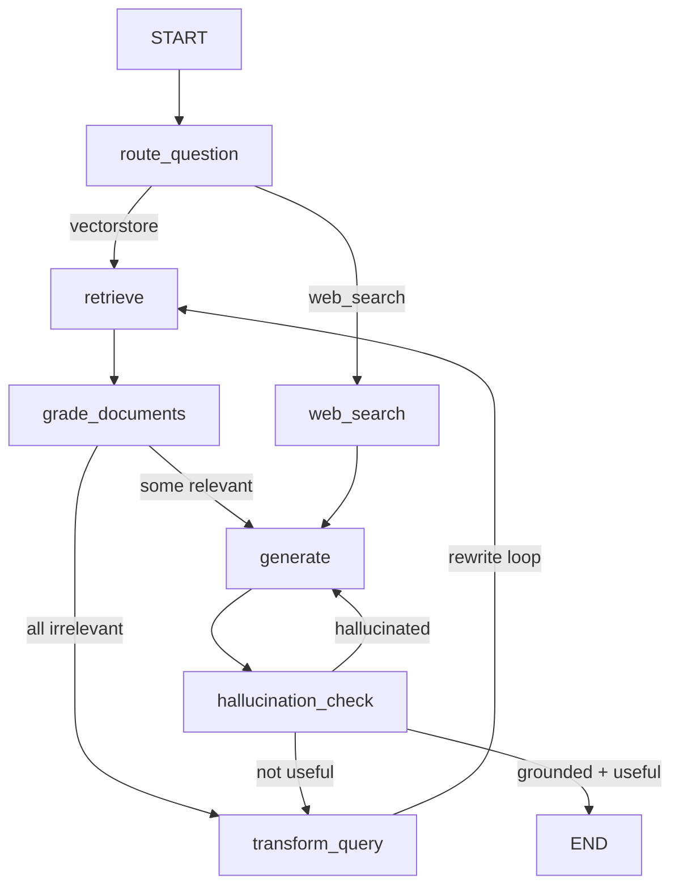

# Certilab Adaptive RAG

Implementación del patrón **Adaptive RAG** con LangGraph, OpenAI y Tavily, aplicada a la consulta de certificados de calibración reales. El grafo de 7 nodos con dos loops de auto-corrección —reescritura de query y verificación de alucinaciones— sigue la topología del artículo de referencia.

**Referencia**: [Building an Adaptive RAG System with LangGraph, OpenAI and Tavily](https://levelup.gitconnected.com/building-an-adaptive-rag-system-with-langgraph-openai-and-tavily-c4ee39d2f021)

## Qué hace

Permite consultar certificados de calibración mediante un pipeline RAG que **se corrige a sí mismo**:

- Si los documentos recuperados no son relevantes → reescribe la pregunta y reintenta (máx. 3 veces).
- Si la respuesta generada alucina → regenera con más contexto (máx. 2 veces).
- Si la respuesta no resuelve la pregunta → reescribe y vuelve a intentar.

El sistema funciona en dos modos:

| Modo | Datos | Vector store | Para qué |
|---|---|---|---|
| `mock` (default) | JSON fixtures locales | En memoria | Demo rápida, sin dependencias externas |
| `real` | MySQL + S3 + Qdrant | Qdrant con OpenAI embeddings | Producción, 154 certificados reales |

## Arquitectura del grafo



### Nodos

| Nodo | Función | Tecnología |
|---|---|---|
| `route_question` | Clasifica la pregunta: ¿vectorstore o web search? | Pydantic structured output + GPT-4o-mini |
| `retrieve` | Recupera documentos del vector store con tenant isolation | Qdrant (real) o InMemory (mock) |
| `grade_documents` | Evalúa relevancia de cada documento recuperado | Pydantic `GradeDocuments` + GPT-4o-mini |
| `transform_query` | Reescribe la pregunta para mejorar la recuperación | GPT-4o-mini + StrOutputParser |
| `web_search` | Busca en la web conocimiento externo | Tavily Search API |
| `generate` | Genera la respuesta con el contexto recuperado | GPT-4o-mini + RAG prompt inline |
| `hallucination_check` | Verifica que la respuesta esté respaldada y sea útil | `GradeHallucinations` + `GradeAnswer` |

### Loops de auto-corrección

1. **Rewrite loop** — si ningún documento pasa el grading: `transform_query → retrieve` (máx. 3 intentos).
2. **Regenerate loop** — si la respuesta alucina: `generate → hallucination_check → generate` (máx. 2 intentos).
3. **Not-useful path** — si la respuesta es correcta pero no resuelve: `hallucination_check → transform_query`.

## Pipeline de ingesta (modo real)

Los certificados de calibración se ingieren desde MySQL y S3 mediante un pipeline de extracción multi-herramienta:

```
MySQL (metadata) ──→ S3 (PDFs) ──→ PyMuPDF (texto limpio)
                                 ├─→ Camelot (tablas, 99% accuracy)
                                 ├─→ PyMuPDF (gráficos >50KB)
                                 └─→ Unstructured (chunking semántico)
                                              ↓
                              OpenAI embeddings (text-embedding-3-small)
                                              ↓
                              Qdrant (tenant isolation por customer_id)
```

Cada chunk en Qdrant incluye payload enriquecido: `certificate_code`, `customer_id`, `issue_date`, `chunk_type`, `parameter`.

### Ejecutar la ingesta

```bash
# Requiere MySQL, S3, Qdrant, y OPENAI_API_KEY configurados en .env
docker compose up -d qdrant
uv run python -m app.adaptive_rag.ingest
```

## Instalación

```bash
git clone https://github.com/emersonheto/certilab-adaptive-rag.git
cd certilab-adaptive-rag
uv sync
cp .env.example .env
# Editar .env con tu OPENAI_API_KEY
```

Para modo real (ingesta desde MySQL + S3):

```bash
uv sync --extra real
```

## Uso

### Demo CLI

```bash
# Modo mock (default — sin servicios externos)
uv run python -m app.adaptive_rag.demo "¿Cuántos certificados tiene el cliente 101?"

# Modo real (requiere Qdrant con datos indexados)
APP_MODE=real uv run python -m app.adaptive_rag.demo "¿Cuál fue la temperatura máxima a 105°C?"
```

### Notebook

```bash
uv run jupyter notebook notebooks/adaptive_rag_demo.ipynb
```

El notebook ejecuta el grafo con `graph.stream()` y muestra cada nodo, incluyendo los loops de auto-corrección en acción.

### Consultas de ejemplo

```bash
# Ruta vectorstore — certificados
"¿Cuántos certificados de calibración emitió ALS PERU en 2026?"

# Ruta web_search — conocimiento externo
"¿Qué norma INDECOPI aplica para calibración de termómetros?"

# Self-correction — demuestra el rewrite loop
"Dame info de la plancha"
```

## Tecnologías

| Capa | Herramienta |
|---|---|
| Lenguaje | Python 3.11+ |
| Grafo RAG | LangGraph (StateGraph) |
| Embeddings | OpenAI text-embedding-3-small |
| LLM | OpenAI GPT-4o-mini |
| Vector store | Qdrant (tenant isolation) |
| Extracción de texto | PyMuPDF (fitz) |
| Extracción de tablas | Camelot (99% accuracy) |
| Chunking semántico | Unstructured (chunk_by_title) |
| Web search | Tavily Search API |
| Schemas | Pydantic v2 (structured output) |
| Observabilidad | Phoenix / OpenInference |
| Datos | MySQL + Amazon S3 |
| Testing | pytest (52 tests) |

## Estructura del proyecto

```
app/
├── adaptive_rag/        # Grafo canónico de 7 nodos + demo CLI + ingesta
│   ├── state.py         # AdaptiveRAGState TypedDict
│   ├── grader.py        # 5 schemas Pydantic (RouteQuery, GradeDocuments, etc.)
│   ├── nodes.py         # 7 node factories con trace_span
│   ├── graph.py         # build_graph + routing condicional
│   ├── demo.py          # CLI: python -m app.adaptive_rag.demo
│   └── ingest.py        # Pipeline: S3 → PyMuPDF → Camelot → Unstructured → Qdrant
├── domain/              # Modelos de dominio (Certificate, Customer)
├── ingestion/           # Loaders (MySQL, S3, mock JSON)
├── retrieval/           # VectorIndex Protocol + QdrantVectorIndex
├── tools/               # Embeddings, OpenAI, Tavily, MySQL connector
├── observability/       # Phoenix tracing (trace_span)
└── security/            # Roles y tenant isolation (Principal, AccessScope)
```

## Pruebas

```bash
uv run pytest -q        # 52 tests
uv run ruff check .     # Linting
uv run mypy app/        # Type checking
```

## Referencias

- [Building an Adaptive RAG System — LevelUp](https://levelup.gitconnected.com/building-an-adaptive-rag-system-with-langgraph-openai-and-tavily-c4ee39d2f021)
- [LangGraph Documentation](https://langchain-ai.github.io/langgraph/)
- [PyMuPDF](https://pymupdf.readthedocs.io/)
- [Camelot](https://camelot-py.readthedocs.io/)
- [Unstructured](https://docs.unstructured.io/)
