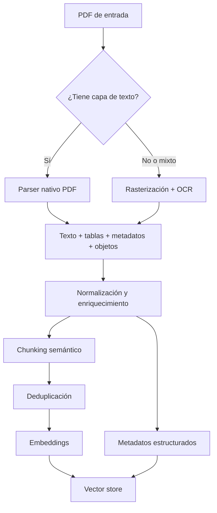
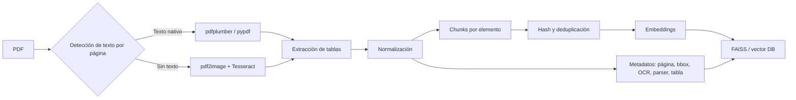
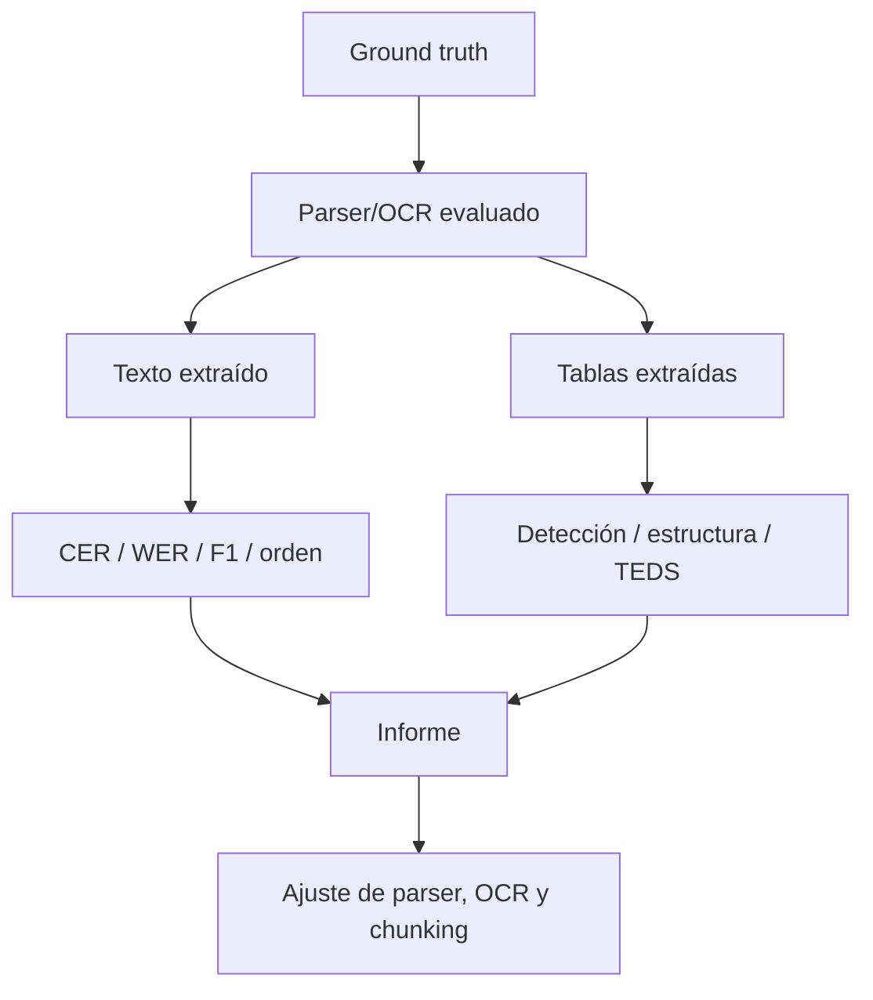

# Extracción de PDFs en Python para alimentar un sistema RAG

## Resumen ejecutivo

La conclusión principal es que **no existe una sola librería “mejor” para todo PDF**. En documentos **nativos o digital-born** conviene extraer primero la capa textual real con herramientas como **pypdf**, **pdfminer.six** o **pdfplumber**, porque un parser de texto puede aprovechar información que el OCR destruye o simplifica, como fuentes, codificaciones, distancias entre caracteres y objetos de página; de hecho, la documentación de pypdf recomienda **no sustituir sistemáticamente** la extracción textual por OCR cuando el PDF ya tiene texto seleccionable. En cambio, en PDFs **escaneados** o mixtos, el camino correcto es una ruta OCR, idealmente con **Tesseract/EasyOCR** si el presupuesto es bajo o con **Google Cloud Vision, AWS Textract o Adobe PDF Services** si se necesita más robustez operativa, salida estructurada o mejor tolerancia a layouts complejos. citeturn5search3turn15search1turn19search3turn2search0turn3search2turn7search2

Para **RAG**, la decisión crítica no es solo “cómo sacar texto”, sino **qué representación almacenar**. Un pipeline sólido conserva, al menos, tres capas: **texto normalizado**, **estructura semántica** y **metadatos ricos**. Eso implica extraer y persistir, cuando existan, **página, bounding box, tipo de elemento, tabla, figura, fuente original, checksum, parser usado, si hubo OCR y con qué confianza**, además de metadatos de documento, formularios, anotaciones o adjuntos cuando aporten valor al retrieval. Herramientas como **pypdf** son especialmente útiles para metadatos, XMP, anotaciones, imágenes y adjuntos; **pdfminer.six** añade acceso útil a formularios AcroForm e imágenes; y **Tika** es valiosa como extractor amplio de **texto + metadata** a través de una interfaz homogénea. citeturn14search1turn14search3turn14search5turn8search2turn1search1turn1search5

En extracción de tablas, la situación es aún más dependiente del documento. Para PDFs tabulares **con capa de texto**, **Camelot** y **Tabula-py** siguen siendo opciones muy eficaces y cómodas, con salida a **DataFrame/CSV/JSON**, pero ambos parten históricamente de la premisa de trabajar sobre **PDFs text-based**, no sobre escaneados. Para tablas difíciles, sin líneas claras, anidadas o visualmente complejas, la evidencia reciente de benchmarking muestra que **las herramientas rule-based no dominan todos los dominios** y que los métodos learning-based suelen comportarse mejor en tablas complejas; dentro de las soluciones consideradas aquí, las nubes document-AI y **Adobe Extract/Textract** suelen ser más seguras cuando hay escaneos, formularios o layouts heterogéneos. citeturn0search2turn1search0turn23search0turn23search5turn24view0turn3search0turn7search2

Mi recomendación práctica, asumiendo **sin restricción** y pensando en calidad para RAG, es una arquitectura híbrida: **detección temprana del tipo de página**, extracción nativa cuando exista texto, OCR solo para páginas sin texto o claramente rasterizadas, **tablas como chunks separados**, **chunking semántico** con preservación de secciones/tablas, **deduplicación por hash** y almacenamiento vectorial con metadatos exhaustivos. Si el corpus es científico, **GROBID** merece una ruta específica por su sesgo a publicaciones técnicas y salida estructurada en **TEI/XML**. Si el corpus es generalista y heterogéneo, **unstructured**, **LangChain** y **Haystack** facilitan mucho la integración con pipelines RAG, aunque no sustituyen por sí mismos un buen extractor base. citeturn17search17turn5search16turn4search2turn9search10turn4search0turn4search1

## Qué puede y no puede prometer cada familia de herramientas

Un PDF no es “texto con formato”, sino un contenedor que puede incluir **texto posicionado, imágenes, tablas implícitas, anotaciones, formularios, adjuntos, cifrado y metadatos**. Ese diseño explica por qué la extracción falla en patrones muy concretos: **orden de lectura en múltiples columnas**, palabras partidas, fórmulas incrustadas, confusión entre cuerpo y pie de figura, tablas con columnas espaciadas por puntos o guiones, y páginas que en realidad son solo una imagen. La literatura comparativa más reciente remarca precisamente que el rendimiento cambia mucho según el tipo de documento y que **la estructura del documento importa tanto como la librería elegida**. citeturn24view0turn14search3turn14search5

Hay cuatro familias útiles para este problema. La primera son los **parsers nativos de PDF**: **pypdf**, **pdfminer.six** y **pdfplumber**. Son los más apropiados cuando existe capa textual, permiten acceso fino a objetos PDF y, en distinto grado, a metadatos, formularios, imágenes y anotaciones. La segunda son los **extractores especializados en tablas**: **Camelot** y **Tabula-py**, muy eficaces sobre tablas textuales. La tercera son los **motores OCR**: **Tesseract**, **EasyOCR** y APIs cloud. La cuarta son los **orquestadores/document loaders** para RAG: **LangChain**, **Haystack**, **unstructured** y, en el nicho científico, **GROBID**. citeturn14search0turn8search2turn15search1turn23search0turn1search0turn19search3turn1search7turn4search0turn4search1turn16search3turn4search2

Un matiz muy importante para RAG es separar **extracción** de **organización semántica**. Por ejemplo, **LangChain** ofrece loaders y una interfaz unificada para vector stores, pero no “mejora” por sí solo la calidad del OCR ni de la lectura PDF; **Haystack** aporta pipelines, splitters, routing y políticas de duplicados; **unstructured** aporta particionado en elementos como `Title`, `NarrativeText`, `ListItem` o `Table`, y además ofrece estrategias de procesamiento PDF como `fast`, `hi_res`, `ocr_only` y `auto`, que son extremadamente útiles para rutas híbridas. citeturn4search0turn5search5turn5search6turn5search14turn2search3turn16search3



## Comparativa de herramientas

La columna **“precisión esperada”** de la tabla siguiente es **cualitativa**, no un benchmark universal. Está estimada a partir de la **naturaleza del algoritmo**, las **capacidades declaradas en la documentación oficial** y la **evidencia comparativa** disponible. En la práctica, la precisión real depende del tipo de PDF, idioma, densidad de tablas, multi-columna, escaneo, ruido y necesidad de preservar estructura. citeturn24view0turn9search0turn21search16

| herramienta | tipo | precisión esperada | ventajas | limitaciones | coste/licencia | ejemplo de comando/fragmento de código mínimo |
|---|---|---|---|---|---|---|
| pdfplumber citeturn15search1turn8search1 | texto, tablas, layout | **Alta** en PDFs nativos bien formados; **media** en layouts complejos; **baja** si el PDF es solo imagen | Acceso fino a chars, líneas y coordenadas; buena depuración visual; tablas configurables; muy útil para postprocesado controlado | La propia documentación indica que funciona mejor en PDFs **machine-generated** que en escaneados | Gratis, **MIT** | `with pdfplumber.open("a.pdf") as pdf: txt = pdf.pages[0].extract_text()` |
| pypdf / PyPDF2 legado citeturn14search0turn13search3 | texto, metadatos, imágenes, anotaciones, adjuntos | **Alta** para texto simple y metadatos; **media** en orden de lectura difícil; **no OCR** | Muy bueno para metadatos/XMP, imágenes, anotaciones, adjuntos, formularios y manipulación PDF; puro Python | No resuelve OCR ni tablas complejas por sí solo; no conviene reemplazar texto nativo por OCR si el PDF ya tiene texto | Gratis, **BSD-3-Clause** | `from pypdf import PdfReader; reader = PdfReader("a.pdf"); txt = reader.pages[0].extract_text()` |
| pdfminer.six citeturn0search1turn8search2turn10search5 | texto, imágenes, formularios, layout | **Alta** en extracción textual detallada; **media** en reconstrucción semántica | Parser profundo del formato PDF; soporta imágenes, AcroForm, CJK y escritura vertical; base de pdfplumber | API más baja y menos cómoda; no es la mejor opción para tablas “lista para ETL” | Gratis, **MIT** | `from pdfminer.high_level import extract_text; txt = extract_text("a.pdf")` |
| Camelot citeturn0search2turn23search0turn10search1 | tablas | **Alta** en tablas text-based con líneas o estructura clara; **media** en borderless simples | Devuelve **DataFrames**; exporta a CSV, JSON, Excel, HTML, Markdown y SQLite; permite tuning fino de parsers | La documentación estable indica que trabaja con PDFs **text-based**, no con escaneados | Gratis, **MIT** | `import camelot; tables = camelot.read_pdf("a.pdf"); df = tables[0].df` |
| Tabula-py citeturn1search0turn23search5turn10search17 | tablas | **Alta** en tablas text-based relativamente limpias; **media** si hay que afinar áreas | Lee tablas a **DataFrame** y convierte a CSV/TSV/JSON; adopción histórica grande | Requiere Java/tabula-java y sigue el caveat de Tabula: **no** para escaneados | Gratis, **MIT** | `import tabula; dfs = tabula.read_pdf("a.pdf", pages="all")` |
| tika-python citeturn1search1turn12search0 | texto, metadata, XHTML | **Media** en PDFs generales; buena como extractor homogéneo de contenido+metadata | Muy útil cuando el repositorio mezcla muchos formatos; extrae texto y metadatos vía `/rmeta` | En tablas suele quedarse corto frente a extractores especializados; depende del ecosistema Tika/Java REST | Gratis, **Apache-2.0** | `from tika import parser; parsed = parser.from_file("a.pdf")` |
| Tesseract + pytesseract citeturn19search3turn19search1 | OCR | **Media-Alta** si hay buen preprocesado y escaneos limpios; **media-baja** en ruido/layout duro | OCR open source, sin coste por página, muchos idiomas, fácil de automatizar localmente | La calidad depende mucho de binarización, resolución y segmentación; no da estructura de tablas/formularios por sí solo | Gratis, **Apache-2.0** | `import pytesseract; txt = pytesseract.image_to_string(img, lang="spa")` |
| EasyOCR citeturn1search7turn10search19 | OCR | **Media-Alta** en imágenes diversas y multilingües; a veces mejor que Tesseract en texto irregular | Soporta 80+ idiomas; cómodo para prototipos y texto de imagen “menos documental” | Más pesado; el output base no es una estructura documental completa; menos orientado a PDF puro | Gratis, **Apache-2.0** | `import easyocr; txt = easyocr.Reader(["es","en"]).readtext("p.png")` |
| Google Cloud Vision citeturn2search0turn20view0 | OCR cloud para imágenes/PDF | **Alta** en OCR general; **media** en documentos con estructura compleja si se necesita semántica de tablas | OCR PDF/TIFF asíncrono; salida **JSON** por página; buen escalado operativo | Para PDFs usa `files:asyncBatchAnnotate`, requiere Cloud Storage y su API oficial es de OCR, no de tablas/formularios semánticos como Textract | Propietario; primer 1.000 units/mes gratis; `Document Text Detection` facturado por página/unidad citeturn20view0 | `client.async_batch_annotate_files(requests=[...])` |
| AWS Textract citeturn3search2turn20view1turn19search6 | OCR + tablas + formularios + queries | **Alta** en escaneados, formularios y tablas; **media-alta** en documentos generales | Extrae texto, tablas, forms, queries y firmas; salida por **Block objects**; buen encaje empresarial | Síncrono limitado a 1 página PDF/TIFF; para multipágina conviene asíncrono en S3 | Propietario, pago por página; ejemplo vigente: OCR desde **$0.0015/página** y tablas desde **$0.015/página** en US West (Oregon) fuera de free tier | `boto3.client("textract").analyze_document(Document={"Bytes": b}, FeatureTypes=["TABLES","FORMS"])` |
| Adobe PDF Services Extract citeturn7search2turn18search3turn20view2 | texto, tablas, imágenes, estructura, OCR cloud | **Alta** en nativos complejos y **alta** en escaneados con salida estructurada | Extrae a **JSON estructurado** o **Markdown**, y genera ZIP con JSON y renditions de tablas/figuras; especialmente útil para LLM/RAG | Tiene límites de tamaño/páginas y es servicio cloud propietario | Propietario; **500 Document Transactions/mes** gratis; pago enterprise/ventas | `# vía SDK/API Extract PDF -> JSON estructurado` |
| unstructured citeturn2search3turn16search15turn11search0 | particionado, tablas, OCR routing, chunking | **Alta** como capa de organización semántica; la precisión real depende de la estrategia/backend | Estrategias `auto`, `fast`, `hi_res`, `ocr_only`; extrae elementos como `Title`, `NarrativeText`, `Table`; muy útil para RAG | Añade complejidad y dependencias; no sustituye al mejor extractor base para cada PDF | OSS gratis, **Apache-2.0** | `partition_pdf("a.pdf", strategy="hi_res", infer_table_structure=True)` |
| LangChain document loaders citeturn4search0turn17search1turn6search6 | loaders/orquestación RAG | **Depende** del backend elegido | Interfaz estándar para `Document`, loaders, splitters y vector stores; `PyPDFLoader` soporta password y `extract_images` | No mejora por sí mismo la calidad de parsing; depende del extractor subyacente | Gratis, **MIT** | `from langchain_community.document_loaders import PyPDFLoader; docs = PyPDFLoader("a.pdf").load()` |
| Haystack citeturn4search1turn5search6turn6search7 | pipelines RAG, routing, splitting, evaluación | **Depende** del converter/backend | Pipelines modulares, `DocumentTypeRouter`, `DocumentSplitter`, políticas de duplicado y evaluación estadística | Requiere diseñar bien la pipeline; no corrige una mala extracción aguas arriba | Gratis, **Apache-2.0** | `splitter = DocumentSplitter(split_by="page", split_length=1)` |
| GROBID citeturn4search2turn8search3turn11search1 | extracción estructurada científica | **Muy alta** en metadata/citas/full text de artículos científicos; **baja-media** fuera de ese dominio | Convierte PDF científico a **TEI/XML**; muy útil para papers, referencias, afiliaciones y metadatos bibliográficos | Enfocado a publicaciones técnicas/científicas; no es un OCR generalista para todo PDF | Gratis, **Apache-2.0** | `client.process("processFulltextDocument", "paper.pdf")` |

Vistas en conjunto, las herramientas abiertas se ordenan bien por capas de responsabilidad. **pypdf** y **pdfminer.six/pdfplumber** son los cimientos cuando existe texto nativo; **Camelot/Tabula-py** son aceleradores para tablas textuales; **Tesseract/EasyOCR** cubren OCR barato; **Textract/Adobe** dominan cuando importa la estructura documental bajo escaneo o formularios; y **unstructured/LangChain/Haystack** son más valiosos como capa de **ingesta, chunking y orquestación** que como extractores “mágicos”. La evidencia comparativa reciente además respalda que **el tipo de documento** determina el parser ganador: no hay una librería universalmente dominante sobre todos los dominios. citeturn24view0turn4search0turn4search1turn16search3

En **mantenimiento y comunidad**, la señal más fuerte hoy está en **pypdf**, **pdfplumber**, **LangChain**, **Haystack**, **unstructured** y **GROBID**, todos con documentación/repositorios claramente activos en 2025-2026. **Camelot** sigue siendo relevante y mantiene documentación activa; **Tabula-py** continúa siendo útil, pero su propuesta es más estable y depende del ecosistema Java; **tika-python** sigue siendo operativo, aunque conceptualmente es una capa Python sobre servicios Tika/Java. citeturn13search3turn15search1turn6search2turn6search3turn11search0turn11search1turn10search16turn1search0turn12search0turn12search14

## Flujo de trabajo recomendado para RAG

Para RAG, el patrón más robusto es **ruteo por tipo de página**, no por documento completo. Muchos PDFs corporativos son mixtos: unas páginas nacieron en digital y otras son imágenes insertadas. La secuencia recomendada es: **detección de capa de texto**, extracción nativa cuando sea posible, **OCR solo en páginas sin texto**, separación explícita de **tablas/figuras/cuerpo**, normalización, chunking con preservación semántica y deduplicación antes de embebido. Ese enfoque está alineado con la recomendación de no aplicar OCR indiscriminadamente a PDFs digital-born y con las estrategias de chunking/partitioning documentadas por **LangChain** y **unstructured**. citeturn5search3turn5search16turn17search17turn2search3

En chunking, la regla práctica es **no mezclar elementos heterogéneos**. Un párrafo narrativo, una tabla y una leyenda de figura no deberían vivir en el mismo chunk salvo que tu caso de uso lo exija explícitamente. Si usas **LangChain**, el splitter genérico recomendado es `RecursiveCharacterTextSplitter`; si usas **unstructured**, la estrategia `by_title` preserva límites de sección; y si usas **Haystack**, `DocumentSplitter` y las políticas de duplicado te ayudan a mantener la indexación controlada. Para tablas, suele funcionar mejor indexar **dos representaciones**: una textual linealizada para recuperación semántica y otra estructurada en JSON/CSV/DataFrame para downstream analytics. citeturn5search0turn5search16turn17search2turn5search6turn5search14



El siguiente ejemplo integra **pdfplumber** para extracción nativa, **pytesseract** para OCR de páginas sin texto y **LangChain** para `Document`, chunking y vectorización. Es un esqueleto realista para producción inicial; después conviene endurecerlo con colas, observabilidad y almacenamiento incremental. La idea central es mantener **texto**, **tablas** y **metadatos** unidos, pero no mezclados en bruto. citeturn15search1turn8search1turn19search3turn4search0turn5search5

```python
from __future__ import annotations

import hashlib
import json
import re
from pathlib import Path
from typing import Any, Dict, List

import pdfplumber
from pypdf import PdfReader
from pdf2image import convert_from_path
import pytesseract

from langchain_core.documents import Document
from langchain_text_splitters import RecursiveCharacterTextSplitter
from langchain_huggingface import HuggingFaceEmbeddings
from langchain_community.vectorstores import FAISS


PDF_PATH = "documento.pdf"
OCR_LANG = "spa+eng"


def normalize_text(text: str) -> str:
    text = text or ""
    text = text.replace("\x00", " ")
    text = re.sub(r"[ \t]+", " ", text)
    text = re.sub(r"\n{3,}", "\n\n", text)
    return text.strip()


def sha256_text(text: str) -> str:
    return hashlib.sha256(text.encode("utf-8")).hexdigest()


def extract_metadata(pdf_path: str) -> Dict[str, Any]:
    reader = PdfReader(pdf_path)
    meta = reader.metadata or {}
    cleaned = {str(k): str(v) for k, v in meta.items() if v is not None}
    cleaned["page_count"] = len(reader.pages)
    cleaned["source"] = str(Path(pdf_path).resolve())
    return cleaned


def page_has_text_layer(plumber_page) -> bool:
    # Heurística simple: si detecta palabras, tratamos la página como nativa
    words = plumber_page.extract_words()
    return len(words) > 0


def extract_tables_from_page(plumber_page, page_num: int) -> List[Document]:
    docs: List[Document] = []
    tables = plumber_page.extract_tables()

    for table_idx, table in enumerate(tables):
        # table es lista de filas
        headers = table[0] if table and table[0] else []
        rows = table[1:] if len(table) > 1 else []

        table_json = {
            "page": page_num,
            "table_id": f"p{page_num}_t{table_idx}",
            "headers": headers,
            "rows": rows,
        }

        # Representación textual linealizada para retrieval semántico
        linearized = []
        if headers:
            linearized.append(" | ".join([str(x or "") for x in headers]))
        for row in rows:
            linearized.append(" | ".join([str(x or "") for x in row]))
        table_text = "\n".join(linearized).strip()

        docs.append(
            Document(
                page_content=table_text,
                metadata={
                    "source": PDF_PATH,
                    "page": page_num,
                    "element_type": "table",
                    "table_id": table_json["table_id"],
                    "table_json": table_json,
                },
            )
        )
    return docs


def extract_pdf_to_documents(pdf_path: str) -> List[Document]:
    all_docs: List[Document] = []
    file_meta = extract_metadata(pdf_path)

    with pdfplumber.open(pdf_path) as pdf:
        for i, page in enumerate(pdf.pages, start=1):
            if page_has_text_layer(page):
                raw_text = page.extract_text() or ""
                content = normalize_text(raw_text)

                if content:
                    all_docs.append(
                        Document(
                            page_content=content,
                            metadata={
                                **file_meta,
                                "page": i,
                                "element_type": "text",
                                "extraction_mode": "native",
                                "parser": "pdfplumber",
                            },
                        )
                    )

                # Extraer tablas como documentos separados
                all_docs.extend(extract_tables_from_page(page, i))

            else:
                # OCR solo en la página afectada
                pil_img = convert_from_path(
                    pdf_path,
                    first_page=i,
                    last_page=i,
                    dpi=300,
                )[0]

                ocr_text = normalize_text(
                    pytesseract.image_to_string(pil_img, lang=OCR_LANG)
                )

                if ocr_text:
                    all_docs.append(
                        Document(
                            page_content=ocr_text,
                            metadata={
                                **file_meta,
                                "page": i,
                                "element_type": "text",
                                "extraction_mode": "ocr",
                                "ocr_engine": "tesseract",
                                "parser": "pdf2image+pytesseract",
                            },
                        )
                    )

    return all_docs


def deduplicate_docs(docs: List[Document]) -> List[Document]:
    seen = set()
    unique_docs: List[Document] = []

    for doc in docs:
        normalized = normalize_text(doc.page_content)
        if not normalized:
            continue
        digest = sha256_text(normalized)
        if digest in seen:
            continue
        seen.add(digest)
        doc.metadata["content_sha256"] = digest
        unique_docs.append(doc)

    return unique_docs


def build_vector_index(docs: List[Document]) -> FAISS:
    splitter = RecursiveCharacterTextSplitter(
        chunk_size=900,
        chunk_overlap=120,
        separators=["\n\n", "\n", ". ", " ", ""],
    )
    chunks = splitter.split_documents(docs)

    # Re-hash por chunk para trazabilidad fina
    for doc in chunks:
        doc.metadata["chunk_sha256"] = sha256_text(normalize_text(doc.page_content))

    embeddings = HuggingFaceEmbeddings(
        model_name="sentence-transformers/paraphrase-multilingual-MiniLM-L12-v2"
    )
    return FAISS.from_documents(chunks, embeddings)


if __name__ == "__main__":
    docs = extract_pdf_to_documents(PDF_PATH)
    docs = deduplicate_docs(docs)
    vectorstore = build_vector_index(docs)
    vectorstore.save_local("faiss_pdf_index")

    # Ejemplo de persistencia paralela de documentos estructurados
    serializable = [
        {
            "text": d.page_content,
            "metadata": d.metadata,
        }
        for d in docs
    ]
    Path("docs_structured.json").write_text(
        json.dumps(serializable, ensure_ascii=False, indent=2),
        encoding="utf-8",
    )

    print(f"Documentos indexados: {len(docs)}")
```

En producción, yo añadiría cuatro mejoras sobre ese esqueleto. Primero, **detección más robusta** de páginas mixtas, por ejemplo comparando longitud de texto extraído con cobertura visual. Segundo, **tablas como objetos de primer nivel** con JSON persistido y, si interesa analytics, una exportación paralela a CSV/DataFrame. Tercero, **hashes por documento, página y chunk** para deduplicar reingestas. Cuarto, una política para **enriquecer consultas**: por ejemplo, si un chunk proviene de una tabla, elevar su score cuando el query contenga patrones numéricos o términos tabulares. Estas decisiones no vienen “resueltas” por la librería: son diseño de pipeline RAG. citeturn17search17turn5search5turn5search14

Ejemplo ilustrativo de salida **JSON estructurada** para un chunk:

```json
{
  "text": "Ingresos netos | 2025-Q1 | 1.250.000",
  "metadata": {
    "source": "/data/documento.pdf",
    "page": 12,
    "element_type": "table",
    "table_id": "p12_t0",
    "extraction_mode": "native",
    "parser": "pdfplumber",
    "content_sha256": "5c6f...",
    "chunk_sha256": "017b..."
  }
}
```

Ejemplo ilustrativo de salida **CSV** para una tabla:

```csv
periodo,ingresos_netos,margen_bruto
2025-Q1,1250000,0.42
2025-Q2,1410000,0.44
```

Ejemplo ilustrativo de **DataFrame** en pandas:

```python
import pandas as pd

df = pd.DataFrame(
    {
        "periodo": ["2025-Q1", "2025-Q2"],
        "ingresos_netos": [1250000, 1410000],
        "margen_bruto": [0.42, 0.44],
    }
)
print(df)
```

```text
   periodo  ingresos_netos  margen_bruto
0  2025-Q1         1250000          0.42
1  2025-Q2         1410000          0.44
```

## Métricas y pruebas sugeridas para evaluar calidad

La evaluación debe separar **texto**, **tablas**, **OCR** y **RAG retrieval**. Para texto extraído de PDFs nativos, conviene medir al menos **exactitud de contenido** y **orden de lectura**. La literatura comparativa reciente usa combinaciones de **Precision, Recall, F1, BLEU y alignment/local alignment** para evaluar texto extraído frente a ground truth, precisamente porque el problema no es solo “qué caracteres salieron”, sino también **si salieron en el orden correcto**, algo crítico en páginas multi-columna. citeturn24view0

Para OCR, las métricas más útiles siguen siendo **CER** y **WER**. La documentación de **jiwer** explica que estas medidas se calculan con la **distancia mínima de edición** entre referencia e hipótesis, y la documentación de Hugging Face sobre WER recuerda que esta métrica contabiliza **sustituciones, inserciones y borrados** a nivel de palabra. En la práctica, **CER** es mejor cuando un solo carácter importa mucho —códigos, importes, identificadores— y **WER** es más interpretable para texto narrativo. citeturn21search0turn21search19

En tablas, conviene distinguir tres niveles. El primero es **detección**: ¿se encontró la tabla donde existe? Ahí sirven **Precision/Recall/F1** sobre cajas o regiones detectadas, como hacen varios benchmarks recientes. El segundo es **estructura**: ¿se reconstruyeron bien filas, columnas y spans? Ahí resulta muy valioso **TEDS**, una métrica basada en tree edit distance diseñada para capturar estructura y contenido de tablas. El tercero es **semántica**: ¿el contenido tabular extraído es equivalente al esperado aunque cambie levemente el HTML o la serialización? La investigación reciente en evaluación semántica de tablas insiste en que las métricas puramente rule-based pueden quedarse cortas cuando dos salidas son semánticamente equivalentes pero no idénticas a nivel de markup. citeturn24view0turn21search16turn21search3turn9search0

Para RAG, además de la extracción, hay que medir **calidad de recuperación**. La evaluación estadística de **Haystack** se apoya en métricas como **precision y recall** con ground truth; y **LangSmith** distingue la relevancia de recuperación del resto de la calidad generativa. Si no conviertes la extracción en una evaluación explícita del retrieval, puedes tener un parser excelente pero un RAG mediocre por chunking o metadatos pobres. citeturn22search1turn22search3turn22search7turn22search13



### Script de prueba para OCR y texto

```python
from __future__ import annotations

import json
import time
from pathlib import Path
from typing import Dict, List

import jiwer


def evaluate_text_pairs(pairs: List[Dict[str, str]]) -> Dict[str, float]:
    refs = [p["reference"] for p in pairs]
    hyps = [p["prediction"] for p in pairs]

    start = time.perf_counter()
    wer = jiwer.wer(refs, hyps)
    cer = jiwer.cer(refs, hyps)
    elapsed = time.perf_counter() - start

    # Exact match bruto por documento
    exact = sum(
        int(r.strip() == h.strip())
        for r, h in zip(refs, hyps)
    ) / max(len(refs), 1)

    return {
        "documents": len(refs),
        "wer": wer,
        "cer": cer,
        "exact_match": exact,
        "eval_seconds": elapsed,
    }


if __name__ == "__main__":
    sample_pairs = [
        {
            "reference": "El importe total es 1250 euros.",
            "prediction": "El importe total es 1250 euros."
        },
        {
            "reference": "La vigencia termina el 31 de diciembre.",
            "prediction": "La vigencia termina eI 31 de diciembre."
        },
    ]
    report = evaluate_text_pairs(sample_pairs)
    Path("ocr_text_report.json").write_text(
        json.dumps(report, ensure_ascii=False, indent=2),
        encoding="utf-8"
    )
    print(report)
```

### Script de prueba para tablas a nivel de celdas

```python
from __future__ import annotations

from typing import List, Tuple, Set


Cell = Tuple[int, int, str]  # fila, columna, valor_normalizado


def normalize_cell(x: str) -> str:
    return " ".join((x or "").strip().split()).lower()


def table_to_cell_set(table: List[List[str]]) -> Set[Cell]:
    cells: Set[Cell] = set()
    for r, row in enumerate(table):
        for c, val in enumerate(row):
            cells.add((r, c, normalize_cell(val)))
    return cells


def precision_recall_f1(pred_table: List[List[str]], gold_table: List[List[str]]):
    pred = table_to_cell_set(pred_table)
    gold = table_to_cell_set(gold_table)

    tp = len(pred & gold)
    fp = len(pred - gold)
    fn = len(gold - pred)

    precision = tp / (tp + fp) if (tp + fp) else 0.0
    recall = tp / (tp + fn) if (tp + fn) else 0.0
    f1 = (
        2 * precision * recall / (precision + recall)
        if (precision + recall)
        else 0.0
    )
    return {
        "tp": tp,
        "fp": fp,
        "fn": fn,
        "precision": precision,
        "recall": recall,
        "f1": f1,
    }


if __name__ == "__main__":
    gold = [
        ["Periodo", "Ingresos"],
        ["2025-Q1", "1250000"],
        ["2025-Q2", "1410000"],
    ]
    pred = [
        ["Periodo", "Ingresos"],
        ["2025-Q1", "1250000"],
        ["2025-Q2", "1401000"],  # error
    ]
    print(precision_recall_f1(pred, gold))
```

### Script operativo para rendimiento, CPU y memoria

```python
from __future__ import annotations

import os
import time
import psutil
from pathlib import Path
from typing import Callable, Any, Dict


def benchmark(fn: Callable[..., Any], *args, **kwargs) -> Dict[str, float]:
    process = psutil.Process(os.getpid())

    cpu_before = process.cpu_times()
    mem_before = process.memory_info().rss
    t0 = time.perf_counter()

    fn(*args, **kwargs)

    dt = time.perf_counter() - t0
    cpu_after = process.cpu_times()
    mem_after = process.memory_info().rss

    return {
        "wall_seconds": dt,
        "cpu_user_seconds": cpu_after.user - cpu_before.user,
        "cpu_system_seconds": cpu_after.system - cpu_before.system,
        "rss_delta_mb": (mem_after - mem_before) / (1024 * 1024),
    }


def dummy_pdf_pipeline(pdf_path: str):
    # reemplazar por tu pipeline real
    _ = Path(pdf_path).exists()


if __name__ == "__main__":
    print(benchmark(dummy_pdf_pipeline, "documento.pdf"))
```

La práctica recomendable es mantener un **conjunto de verdad-terreno versionado** con al menos cinco clases de documentos: nativo simple, nativo multi-columna, scan limpio, scan ruidoso y tabla compleja. Para cada versión del pipeline, registra: **CER/WER**, **F1 de tablas por celdas**, **fallos por página**, **latencia por página**, **CPU/RSS**, **ratio de páginas que van por OCR**, y, ya en RAG, **recall/precision de retrieval** y una medida de relevancia o groundedness. citeturn24view0turn22search1turn22search3turn22search7

## Consideraciones de escalado y despliegue

La primera decisión de escalado es si paralelizas **por documento** o **por página**. Para corpus homogéneos y medianos, paralelizar por documento suele simplificar estado y logging. Para PDFs muy largos o mixtos, paralelizar por página da mejor latencia y permite enviar solo las páginas problemáticas a OCR o a un servicio cloud caro. En una arquitectura madura, la mejor práctica es enrutar por **MIME/tipo** y luego por **características de página**, algo que encaja muy bien con el enfoque de **DocumentTypeRouter** de Haystack y con las estrategias PDF de **unstructured**. citeturn4search5turn2search3turn16search3

Las limitaciones operativas de los servicios cloud deben entrar en el diseño desde el principio. **Google Cloud Vision** procesa PDFs mediante una operación **asíncrona** que escribe la salida en **JSON** en Cloud Storage. **Amazon Textract** distingue claramente flujos síncronos y asíncronos: el síncrono sirve para documentos pequeños o de una página, mientras que el asíncrono es el camino para multipágina en PDF/TIFF; además, las cuotas fijas incluyen hasta **3.000 páginas** y **500 MB** para PDFs/TIFF asíncronos. **Adobe Extract** impone límites que cambian la arquitectura: archivos hasta **100 MB**, tope documentado de **400 páginas** para no escaneados, **150 páginas o menos** para escaneados y recomendación explícita de **particionar** archivos grandes o muy complejos. citeturn18search6turn2search0turn18search4turn19search6turn18search3turn18search7

En open source, los cuellos de botella típicos son otros: rasterización de páginas, OCR CPU-bound, serialización de tablas y explosión del número de chunks. Aquí conviene aplicar **batching** de OCR, caché de imágenes temporales, colas de reintento y una política de “short-circuit”: si un parser nativo extrae texto suficiente, **no** dispares OCR. Si usas **pypdf** para imágenes, la propia documentación advierte que iterar directamente sobre `page.images` puede lanzar excepciones en archivos rotos, por lo que conviene tratar la extracción de imágenes como un proceso robusto y tolerante a fallos. Además, **GROBID** recomienda explícitamente ejecutar su servicio web en **modo web service** sobre una **máquina multi-core** para producción y benchmarking. citeturn5search3turn14search2turn8search3

La observabilidad mínima para una pipeline PDF→RAG debería registrar: **documentos/hora**, **páginas/hora**, **latencia media por página**, **porcentaje OCR**, **CER/WER de muestra**, **error rate por parser**, **tablas detectadas por página**, **chunks producidos por documento**, **ratio de deduplicación**, **tiempo de embebido**, y, ya en retrieval, **precision/recall/relevance** del sistema. Haystack y LangSmith ofrecen marcos útiles para formalizar esta evaluación en el tiempo; no solo para pruebas offline, sino también para detectar regresiones entre versiones del pipeline. citeturn22search1turn22search3turn22search4turn22search7

Si el volumen es alto y el coste importa, el diseño ganador suele ser **híbrido por excepciones**: parseo nativo local barato para la mayoría, OCR local para una fracción, y envío a cloud solo de páginas o documentos que fallen la validación interna. Ese patrón reduce coste y, al mismo tiempo, mejora calidad porque reservas las soluciones más caras para los casos de verdad difíciles: formularios, tablas muy complejas, scans de baja calidad o documentos con múltiples columnas y artefactos. citeturn20view1turn20view2turn20view0turn24view0

## Recomendaciones finales según caso de uso

**Documentos nativos, principalmente textuales.** La combinación más equilibrada es **pypdf + pdfplumber** o **pdfminer.six + pdfplumber**. Usa pypdf para metadatos, XMP, anotaciones, imágenes y adjuntos; pdfplumber para texto controlado, coordenadas y tablas ligeras. Evita OCR salvo en páginas sin texto real. Para RAG, divide con `RecursiveCharacterTextSplitter` o chunking por elementos si la segmentación visual importa. citeturn14search1turn14search3turn14search5turn15search1turn5search3turn5search16

**PDFs escaneados o mixtos.** Si el presupuesto es limitado, parte de **pdf2image + Tesseract** y añade un buen preprocesado de imagen. Si necesitas fiabilidad operacional, mejor salida estructurada y menos tuning manual, la elección práctica es **AWS Textract** o **Adobe PDF Services**; **Google Cloud Vision** es excelente como OCR PDF asíncrono, pero su salida oficial es más bien de OCR por página en JSON, no una semántica de tablas/formularios tan explícita como Textract. citeturn19search3turn3search2turn20view1turn7search2turn2search12turn2search0turn18search6

**Tablas complejas.** Si son textuales y relativamente “limpias”, comienza con **Camelot** y evalúa también **Tabula-py**. Si aparecen tablas nested, borderless, de colores o con layouts imprevisibles, asume que las reglas puras sufrirán y considera **Adobe Extract**, **Textract** o una ruta basada en modelos. Incluso los estudios comparativos recientes concluyen que la detección y reconstrucción de tablas sigue siendo uno de los puntos débiles de los parsers rule-based en documentos heterogéneos. citeturn23search0turn1search0turn24view0turn21search16

**Metadatos, formularios, anotaciones y datos incrustados.** Aquí **pypdf** destaca claramente dentro del stack Python por su soporte para **metadata/XMP, anotaciones, imágenes y attachments**, mientras que **pdfminer.six** es útil para **AcroForm**. **Tika** añade una capa homogénea cuando el repositorio mezcla muchos formatos y necesitas un pipeline común de metadata + content, aunque no sea la mejor herramienta para tablas complejas. citeturn14search1turn14search3turn14search5turn8search2turn1search1turn1search5

**Volumen alto y presupuesto limitado.** Prioriza **OSS local**: pypdf/pdfplumber para nativos, **Tesseract** para OCR, **Camelot/Tabula-py** para tablas textuales y un vector store local como **FAISS** a través de **LangChain** o un pipeline completo con **Haystack**. El ahorro es muy importante, pero exige invertir en QA, tests y observabilidad porque la variabilidad documental la absorberás tú, no el proveedor cloud. citeturn19search3turn15search1turn23search0turn1search0turn5search5turn4search1

**Corpora científicos, papers y referencias bibliográficas.** Usa una ruta específica con **GROBID**. Su foco en publicaciones técnicas/científicas y su salida **TEI/XML** lo hacen especialmente fuerte para títulos, autores, afiliaciones, referencias, citas y full text estructurado. Para RAG científico, puede convivir con un parser generalista: GROBID para estructura bibliográfica y pypdf/pdfplumber para fallback o enriquecimiento. citeturn4search2turn9search10turn8search3

**Integración RAG de propósito general.** Si quieres controlar cada paso, **LangChain** es una capa práctica para loaders, splitters y vector stores. Si prefieres pipelines más explícitas con routing, evaluación y políticas de duplicados, **Haystack** suele ser más ergonómico. Si tu dolor principal es convertir PDFs heterogéneos a **elementos semánticos** antes del chunking, **unstructured** es una excelente capa intermedia. En muchos equipos, la combinación más razonable hoy es: **extractor base especializado + unstructured para particionado + LangChain o Haystack para orquestación RAG**. citeturn4search0turn5search5turn4search1turn5search14turn16search3turn17search17

En una frase, la arquitectura que más suele resistir el paso a producción es esta: **parser nativo primero, OCR solo cuando haga falta, tablas como objetos de primera clase, metadatos exhaustivos, chunking semántico y evaluación continua**. Ese patrón minimiza coste, maximiza trazabilidad y es el que mejor encaja con la naturaleza real —y desordenada— de los PDFs que acaban alimentando un sistema RAG. citeturn5search3turn17search17turn22search3turn24view0